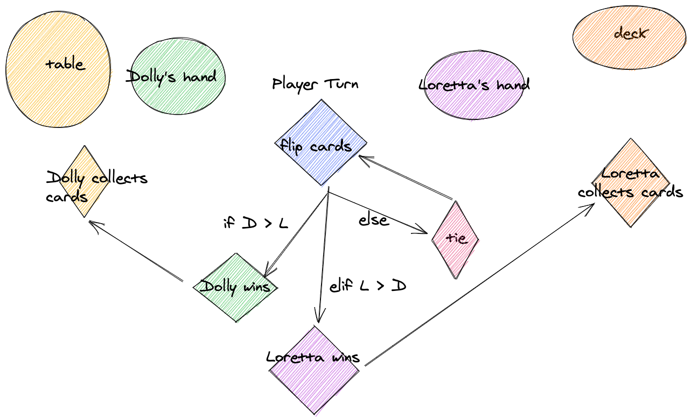

> Control Flow in Python

---

> A Control Flow Graph is a visual representation of all the possible paths a program can take when it is executed.

---

## **Process Block** - A statement or continuous series of statements with one entry point and one exit point 
## **Decision** - Place in code where the control flow can diverge

---

## **Junction** - Place in code where the control flow can merge
## **Repetition** - Place in code where a process block is repeated
---

# **Decisions in Python**

- ```if```
- ```if else```
- ```if elif else```

---

# **Repetitions in Python**

- ```for``` loops
- ```while``` loops

Use a _for loop_ when you know exactly how many times you want to execute the loop 
Or when you have a specific list of items to loop through.

Use a _while loop_ when you want something to continue until a condition changes, for example a player's turn continues until they run out of lives.

---

